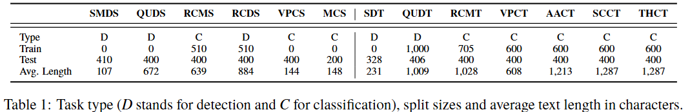

# DharmaBench: A Benchmark for Buddhist Texts in Sanskrit and Classical Tibetan

**DharmaBench** is a multi-task benchmark suite for evaluating large language models (LLMs) on classification and detection tasks in historical Buddhist texts written in Sanskrit and Classical Tibetan. The benchmark includes 13 tasks (6 Sanskrit, 7 Tibetan), with 4 share in both languages.

This repository contains only the **dataset files** that are released under CC BY 4.0 License. Code for evaluation and full model results is released separately (TBD).

## 📂 Repository Structure

DharmaBench/\
├── Sanskrit/ \
│   ├── SMDS/\
│   │   └── test.json\
│   ├── QUDS/\
│   │   └── test.json\
│   └── ...\
├── Tibetan/\
│   ├── SDT/\
│   │   └── test.json\
│   ├── AACT/\
│   │   └── test.json\
│   │   └── train.json\
│   └── ...\
└── src/ \
└── README.md \
└── ...

- Each task is stored in its own subdirectory under either `Sanskrit/` or `Tibetan/`.
- Datasets include `test.json`, if applicable also `train.json`.
- All files are standardized with minimal, unified fields. Each entry includes an `id` field.

## 🧠 Tasks

We define 13 benchmark tasks across Sanskrit and Classical Tibetan. Each task below lists the language, the input, and the expected output.

### Sanskrit Tasks

1. **Simile and Metaphor Detection in Sanskrit (SMDS)**  
   Detection of *upamā* (similes) and *rūpaka* (metaphors) in Sanskrit Buddhist texts. The input is a text, potentially containing similes and/or metaphors. The output should be a list of detections and their type.

2. **Quotation Detection in Sanskrit (QUDS)**  
   Detection of explicit quotations from other works, with possible extraction of author and title names. The input is a text. The output is a list of spans labeled as QUOTE, TITLE, or AUTHOR.

3. **Root-Text and Commentary Matching in Sanskrit (RCMS)**  
Classification of whether a given commentary passage matches a given verse or excerpt from a root-text. The input is a pair: root-text and candidate commentary. The output is TRUE if matching, otherwise FALSE.

4. **Root-Text and Commentary Detection in Sanskrit (RCDS)**  
   Given a root-text and a candidate passage, detect the exact span of commentary if present. The input is a pair: root-text and candidate passage. The output is the commentary span(s) or “none” if no match exists.

5. **Verse vs. Prose Classification in Sanskrit (VPCS)**  
   Document-level classification of a Sanskrit text as predominantly verse or prose. The input is an entire text. The output is either VERSE or PROSE.

6. **Metre Classification in Sanskrit (MCS)**  
   Classification of a Sanskrit verse into one of ten common metrical patterns. The input is a verse. The output is the metre label.

### Tibetan Tasks

1. **Simile Detection in Tibetan (SDT)**  
   Detection of *dpe rgyan* (similes) in Tibetan Buddhist texts. The input is a text, potentially containing similes. The output should be a list of simile spans.

2. **Quotation Detection in Tibetan (QUDT)**  
   Detection of explicit quotations from other works. The input is a text. The output is a list of QUOTE spans.

3. **Root-Text and Commentary Matching in Tibetan (RCMT)**  
   Classification of whether a given commentary passage matches a given root-text. The input is a pair: root-text and candidate commentary. The output is TRUE if matching, otherwise FALSE.

4. **Verse vs. Prose Classification in Tibetan (VPCT)**  
   Document-level classification of a Tibetan text as predominantly verse or prose. The input is an entire text. The output is either VERSE or PROSE.

5. **Allochthonous vs. Autochthonous Classification in Tibetan (AACT)**  
   Classification of a Tibetan text as translated from another language (ALLO) or composed in Tibetan (AUTO). The input is a text. The output is ALLO or AUTO.

6. **Scriptures vs. Non-scriptures Classification in Tibetan (SCCT)**  
   Classification of a Tibetan canonical text as scripture (SCR) or non-scripture (NSCR). The input is a text. The output is SCR or NSCR.

7. **Thematic Classification in Tibetan (THCT)**  
   Classification of a Tibetan canonical text into one of 13 predefined Buddhist themes. The input is a text. The output is the theme label.

### 🌐 Multilingual Tasks

Several tasks are designed in both Sanskrit and Classical Tibetan to enable cross-lingual evaluation and comparison:

| Task Name                        | Sanskrit Code | Tibetan Code |
|---------------------------------|---------------|--------------|
| Simile and Metaphor Detection   | SMDS          | SDT          |
| Quotation Detection             | QUDS          | QUDT         |
| Root-Text and Commentary Matching | RCDS          | RCMT         |
| Verse vs. Prose Classification  | VPCS          | VPCT         |

## 📊 Dataset Sizes

The table below summarizes the number of samples in each dataset split for all tasks included in DharmaBench. Training splits are included when available.

## 📜 Citation

If you use DharmaBench in your research, please cite:

TBD

## 🤝 License

- **Data**: CC BY 4.0  
- **Evaluation Code** (not included here): Apache 2.0

## 📫 Contact

For questions or contributions, please contact golankai@gmail.com.